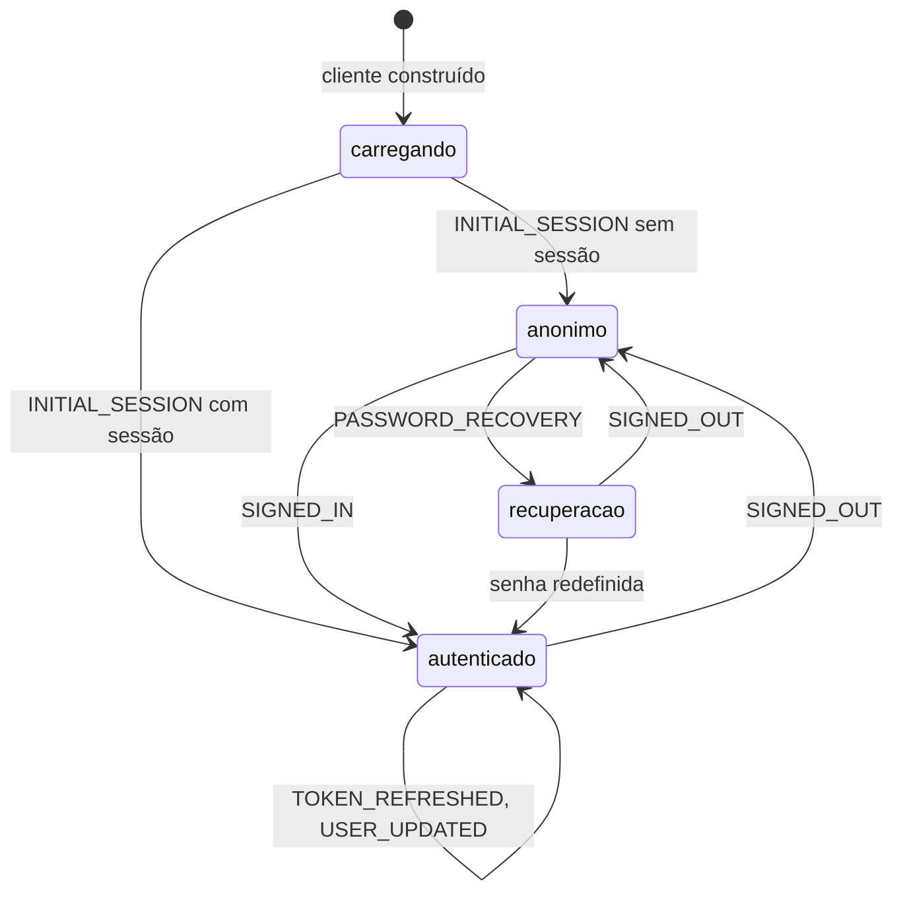
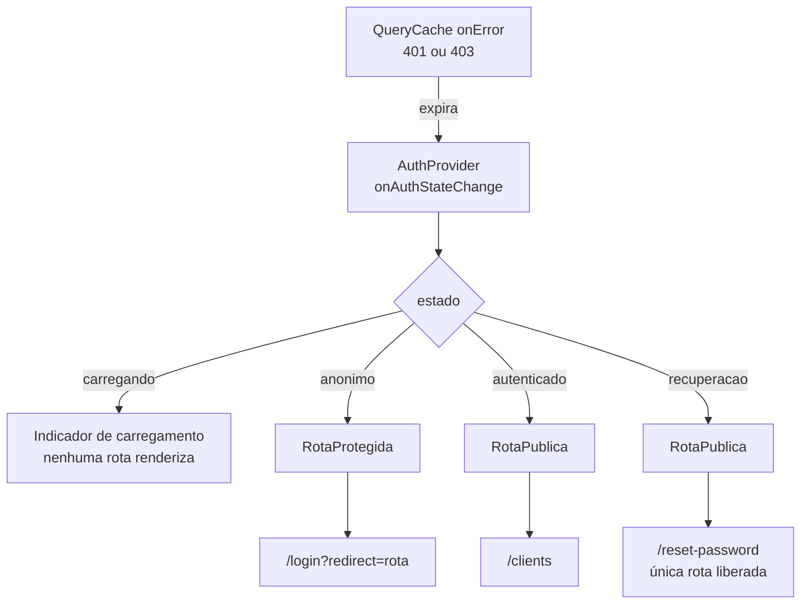

# Auth Design

**Spec**: `.specs/features/auth/spec.md`
**Context**: `.specs/features/auth/context.md`
**Status**: Draft

---

## Architecture Overview

A sessão não é dado de servidor a ser buscado e revalidado: é estado empurrado por
um fluxo de eventos. `AuthProvider` assina `onAuthStateChange` uma única vez e
traduz esse fluxo em três coisas que a árvore consome por contexto: a sessão, um
estado de resolução, e a marca de recuperação de senha.

O estado de resolução é o que resolve o requisito mais delicado do PLAN §6 — não
redirecionar antes de saber se há sessão. Ele tem três valores, e só sai de
`carregando` quando o evento `INITIAL_SESSION` chega, que é exatamente o momento
em que o supabase-js terminou de ler o armazenamento local.



Duas guardas leem esse estado, e elas são simétricas:



### A colisão da recuperação de senha, e por que ela existe

O link de recuperação **autentica** o usuário: o supabase-js lê o token da URL e
estabelece sessão, emitindo `PASSWORD_RECOVERY` em vez de `SIGNED_IN`. Sem
distinguir esse caso, a regra do AUTH-11 — autenticado sai das rotas públicas —
expulsaria o consultor da própria tela de redefinir senha.

`AuthProvider` marca a sessão como de recuperação ao receber aquele evento. Enquanto
a marca vale, `/reset-password` é acessível e a regra de redirecionamento não se
aplica a ela. Sem a marca, a rota exibe a orientação de pedir um link novo, que é o
AUTH-08 AC7. A marca cai quando a senha é redefinida ou a sessão termina.

---

## Code Reuse Analysis

### Existing Components to Leverage

| Componente | Origem | Como é usado |
| ---------- | ------ | ------------ |
| `AppLayout` | `foundation` T18 | A prop `acoesDoUsuario` recebe `MenuDoUsuario`, cumprindo AUTH-15 |
| `PublicLayout` | `foundation` T19 | Moldura de login, cadastro, esqueci e redefinir |
| `rotas` | `foundation` T19 | As rotas de `auth` entram como filhas dos dois layouts existentes |
| `supabase` | `foundation` T14 | Cliente único e tipado; nenhuma feature cria o próprio |
| `queryClient` | `foundation` T17 | `deveTentarDeNovo` já não repete erro de autorização; aqui ganha o gancho de expiração |
| `ehErroDeAutorizacao` | `foundation` T17 | Reaproveitada para classificar a falha, com a distinção de código descrita abaixo |
| `ErroDeRota` | `foundation` T20 | Já registrada nas rotas de topo; cobre as telas de `auth` sem trabalho extra |
| Tokens de tema | `foundation` T4 | `--color-danger` para erro, `--color-focus` para foco visível |

### Integration Points

| Sistema | Método de integração |
| ------- | -------------------- |
| Supabase Auth | `signUp`, `signInWithPassword`, `signOut`, `resetPasswordForEmail`, `updateUser`, `onAuthStateChange` |
| `public.profiles` | Leitura e atualização de `full_name` e `phone`; o registro nasce do trigger (AD-005) |
| TanStack Query | Cache do perfil; `QueryCache.onError` como segundo detector de expiração |
| React Router | Guardas como componentes de rota, sem `loader` (AD-013) |

---

## Components

### `features/auth/AuthProvider.tsx`

- **Purpose**: Traduz o fluxo de eventos do Supabase em estado de sessão para a árvore.
- **Location**: `src/features/auth/AuthProvider.tsx`
- **Interfaces**:
  - `<AuthProvider>{children}</AuthProvider>`
  - contexto: `{ estado: 'carregando' | 'anonimo' | 'autenticado', sessao: Session | null, emRecuperacao: boolean }`
- **Dependencies**: `supabase`, `queryClient`
- **Reuses**: cliente e query client da `foundation`
- **Nota crítica**: o callback de `onAuthStateChange` é **síncrono** e só atualiza estado local. A documentação do Supabase se contradiz aqui — um guia de troubleshooting descreve deadlock quando uma chamada assíncrona roda dentro do callback, travando todas as chamadas seguintes do cliente, enquanto a referência da API diz que é seguro. Adotamos a leitura conservadora: nenhum `await`, nenhuma consulta ao banco dentro do callback. Buscar o perfil é trabalho do TanStack Query, disparado pela mudança de estado.

### `features/auth/use-auth.ts`

- **Purpose**: Acesso tipado ao contexto, com erro claro fora do provedor.
- **Location**: `src/features/auth/use-auth.ts`
- **Interfaces**: `useAuth(): EstadoDeAutenticacao`
- **Dependencies**: contexto de `AuthProvider`

### `features/auth/services/auth-service.ts`

- **Purpose**: Envolve as chamadas de autenticação e traduz os erros do Supabase para mensagens do produto.
- **Location**: `src/features/auth/services/auth-service.ts`
- **Interfaces**:
  - `entrar(credenciais): Promise<Resultado>`
  - `cadastrar(dados): Promise<Resultado>`
  - `sair(): Promise<void>`
  - `pedirRecuperacao(email): Promise<Resultado>`
  - `redefinirSenha(novaSenha): Promise<Resultado>`
  - `traduzirErro(erro: AuthError): string`
- **Dependencies**: `supabase`
- **Reuses**: cliente da `foundation`
- **Nota**: `traduzirErro` é o ponto único onde a discrição das mensagens é imposta. Credencial inválida e e-mail inexistente convergem para a mesma frase; sem isso a tela de login vira um oráculo que confirma quais e-mails têm conta.

### `features/auth/components/RotaProtegida.tsx` e `RotaPublica.tsx`

- **Purpose**: As duas guardas, simétricas.
- **Location**: `src/features/auth/components/`
- **Interfaces**: componentes de rota, renderizam `<Outlet />` ou `<Navigate />`
- **Dependencies**: `useAuth`, `react-router`
- **Nota**: ambas renderizam indicador de carregamento enquanto `estado === 'carregando'`. `RotaProtegida` guarda a rota pretendida em `?redirect=`; `RotaPublica` libera `/reset-password` enquanto `emRecuperacao`.

### `features/auth/schemas.ts`

- **Purpose**: Schemas Zod das cinco entradas de formulário.
- **Location**: `src/features/auth/schemas.ts`
- **Interfaces**: `schemaDeLogin`, `schemaDeCadastro`, `schemaDeRecuperacao`, `schemaDeNovaSenha`, `schemaDePerfil`, mais os tipos inferidos
- **Dependencies**: Zod
- **Nota**: a confirmação de senha usa refinamento com caminho no campo de confirmação, para que a mensagem apareça onde o consultor está olhando.

### `features/auth/pages/`

Cinco páginas: `Login`, `Cadastro`, `EsqueciSenha`, `RedefinirSenha`, `Perfil`. Cada
uma compõe React Hook Form com `zodResolver` e consome `auth-service`.

### `features/auth/components/MenuDoUsuario.tsx`

- **Purpose**: Preenche o espaço reservado no cabeçalho pelo `AppLayout`.
- **Location**: `src/features/auth/components/MenuDoUsuario.tsx`
- **Interfaces**: exibe o nome do perfil e a ação de sair
- **Reuses**: espaço `acoesDoUsuario` de `AppLayout`

### `components/ui/Campo.tsx`, `Botao.tsx`, `Alerta.tsx`

- **Purpose**: Os primeiros componentes reutilizáveis de interface.
- **Location**: `src/components/ui/`
- **Nota**: `Campo` associa rótulo visível, mensagem de erro e `aria-describedby`. Rótulo real, nunca texto de exemplo fazendo as vezes dele (PLAN §11). `Botao` carrega o estado de envio e desabilita durante a operação, que é o que impede submissão duplicada em AUTH-01 AC6.

### `lib/query-client.ts` (modificação)

- **Purpose**: Ganha um `QueryCache.onError` que classifica 401 e 403 como expiração.
- **Nota**: `ehErroDeAutorizacao` hoje agrupa `42501` com 401 e 403, o que é correto para decidir *não repetir* a tentativa, mas errado para decidir *encerrar a sessão*. A função ganha uma irmã, `ehSessaoExpirada`, que reconhece apenas os status HTTP. A distinção é a emenda registrada no spec.

---

## Data Models

```typescript
type EstadoDeAutenticacao =
  | { estado: 'carregando'; sessao: null; emRecuperacao: false }
  | { estado: 'anonimo'; sessao: null; emRecuperacao: false }
  | { estado: 'autenticado'; sessao: Session; emRecuperacao: boolean }
```

União discriminada de propósito: o estado `carregando` não tem sessão, e o
compilador impede ler `sessao.user` sem antes estreitar o estado — o erro que
produziria o redirecionamento prematuro que o PLAN §6 proíbe.

O perfil vem dos tipos gerados: `Database['public']['Tables']['profiles']['Row']`
para leitura e `['Update']` para a edição, restrita a `full_name` e `phone` pelo
grant de coluna (AD-014).

---

## Error Handling Strategy

| Cenário | Tratamento | Impacto para o consultor |
| ------- | ---------- | ------------------------ |
| Credencial inválida | `traduzirErro` devolve "E-mail ou senha inválidos" | Mesma frase para e-mail inexistente e senha errada |
| E-mail já cadastrado | Mensagem orientando entrar ou recuperar; formulário preservado | Não perde o que digitou |
| Falha de rede no login | Mensagem de falha temporária, distinta de credencial inválida | Sabe que vale tentar de novo |
| Limite de requisições excedido | Mensagem pedindo para aguardar | Distinta de credencial inválida |
| Recuperação para e-mail sem conta | Mesma confirmação neutra do caso com conta | Não revela quem tem conta |
| Link de recuperação inválido ou expirado | Tela explica e oferece pedir novo link | Caminho de saída claro |
| 401 ou 403 em qualquer consulta | `QueryCache.onError` limpa o cache, avisa e leva a `/login?redirect=` | Volta ao ponto onde estava após entrar |
| `42501` da RLS | Erro de permissão tratado pela tela que o originou | **Não** é deslogado |
| Perfil ilegível após cadastro | Mantém a sessão e exibe o CRM sem o nome | Não é derrubado para o login |
| `localStorage` indisponível | Aviso de que a sessão não poderá ser mantida | Entende por que precisa entrar de novo |

---

## Risks & Concerns

| Concern | Onde | Impacto | Mitigação |
| ------- | ---- | ------- | ---------- |
| Deadlock do supabase-js quando há chamada assíncrona dentro do callback de `onAuthStateChange`; a documentação se contradiz sobre isso | `AuthProvider.tsx` | Todas as chamadas seguintes do cliente travam sem erro, e o app parece pendurado | Callback estritamente síncrono, só atualizando estado. Teste que falha se o callback virar assíncrono |
| A sessão de recuperação é uma sessão real e persiste se o consultor abandonar a tela | `AuthProvider.tsx` | Quem pediu recuperação e fechou a aba fica autenticado sem ter provado saber a senha | Registrado como risco aceito nesta feature; encerrar a sessão ao sair de `/reset-password` sem redefinir é a mitigação, a confirmar com o usuário na fase Tasks |
| `INITIAL_SESSION` pode não chegar se o armazenamento local estiver bloqueado | `AuthProvider.tsx` | A guarda ficaria presa em `carregando` para sempre, com a tela em branco | Limite de tempo que resolve para `anonimo` e exibe o aviso de armazenamento indisponível |
| `42501` e 401 chegam pelo mesmo caminho de erro | `lib/query-client.ts` | Confundir os dois desloga o consultor por um erro de permissão legítimo | `ehSessaoExpirada` separada de `ehErroDeAutorizacao`, com teste cobrindo os dois códigos |
| Mensagem genérica de credencial pode mascarar erro real de configuração | `auth-service.ts` | Um projeto Supabase mal configurado pareceria "senha errada" | `traduzirErro` registra o erro original no console antes de devolver a frase genérica |
| `site_url` do `config.toml` aponta para a porta 3000 e `minimum_password_length` está em 6 | `supabase/config.toml` | O link de recuperação chega apontando para a porta errada; o mínimo de senha diverge do spec | Ajuste na primeira tarefa desta feature, pendência herdada de `foundation` T6 |
| Nenhuma proteção contra tentativas repetidas de login | Supabase Auth | Força bruta contra uma conta conhecida | O Supabase aplica limite por padrão; o produto apenas traduz a resposta. Registrado como fora de escopo do MVP |

---

## Tech Decisions

| Decisão | Escolha | Justificativa |
| ------- | ------- | ------------- |
| Onde a sessão vive | Contexto próprio alimentado por `onAuthStateChange` | Sessão é estado empurrado, não dado buscado. Modelá-la como query criaria a esquisitice de a limpeza de cache na expiração precisar preservar a própria entrada da sessão |
| Fim do estado de carregamento | Evento `INITIAL_SESSION` | Marca exatamente o instante em que o supabase-js terminou de ler o armazenamento. Uma promessa de `getSession()` daria o mesmo resultado por outro caminho, mas com duas fontes de verdade para o mesmo fato |
| Forma do estado | União discriminada | Faz o compilador impedir a leitura da sessão antes de saber que ela existe |
| Rota de recuperação | Marca `emRecuperacao` no provedor | Único caminho que distingue autenticado por link de autenticado normalmente, e portanto o único que cumpre AUTH-08 AC7 |
| Classificação do erro de autorização | `ehSessaoExpirada` separada de `ehErroDeAutorizacao` | Repetir a tentativa e encerrar a sessão são decisões diferentes sobre o mesmo erro. `42501` responde não à primeira e não à segunda |
| Discrição das mensagens | Centralizada em `traduzirErro` | Um único ponto a auditar. Espalhar a decisão pelas telas garante que uma delas vaze a informação |
| Componentes de interface | `Campo`, `Botao` e `Alerta` nascem aqui | São os três que as cinco telas de `auth` já exigem. Criar mais antes de haver segundo consumidor seria abstração especulativa |

> Nenhuma decisão desta feature é de nível de projeto: todas ficam nesta tabela. As
> convenções que ela segue — AD-003, AD-005, AD-007, AD-008, AD-013, AD-014 — já
> estavam registradas.

---

## Requirement → Design Mapping

| Requisito | Realizado por |
| --------- | ------------- |
| AUTH-01 | `schemas.ts` (`schemaDeCadastro`) e `pages/Cadastro.tsx` |
| AUTH-02 | `auth-service.cadastrar` com `full_name` em `user_metadata`, lido pelo trigger (AD-005) |
| AUTH-03 | `traduzirErro` para e-mail existente e falha de rede |
| AUTH-04 | `auth-service.entrar` e `pages/Login.tsx`, com a frase genérica |
| AUTH-05 | `AuthProvider` reagindo a `INITIAL_SESSION` |
| AUTH-06 | `auth-service.sair` mais limpeza do cache no provedor |
| AUTH-07 | `auth-service.pedirRecuperacao` com resposta neutra |
| AUTH-08 | `pages/RedefinirSenha.tsx` e a marca `emRecuperacao` |
| AUTH-09 | `RotaProtegida` com os três estados |
| AUTH-10 | Parâmetro `redirect` escrito por `RotaProtegida` e lido por `Login` |
| AUTH-11 | `RotaPublica`, com a exceção de `/reset-password` em recuperação |
| AUTH-12 | `QueryCache.onError` mais `ehSessaoExpirada` |
| AUTH-13 | `pages/Perfil.tsx` lendo `profiles`, e-mail somente leitura (AD-008) |
| AUTH-14 | `schemaDePerfil` e a atualização restrita pelo grant de coluna (AD-014) |
| AUTH-15 | `MenuDoUsuario` no espaço que `AppLayout` reservou |
