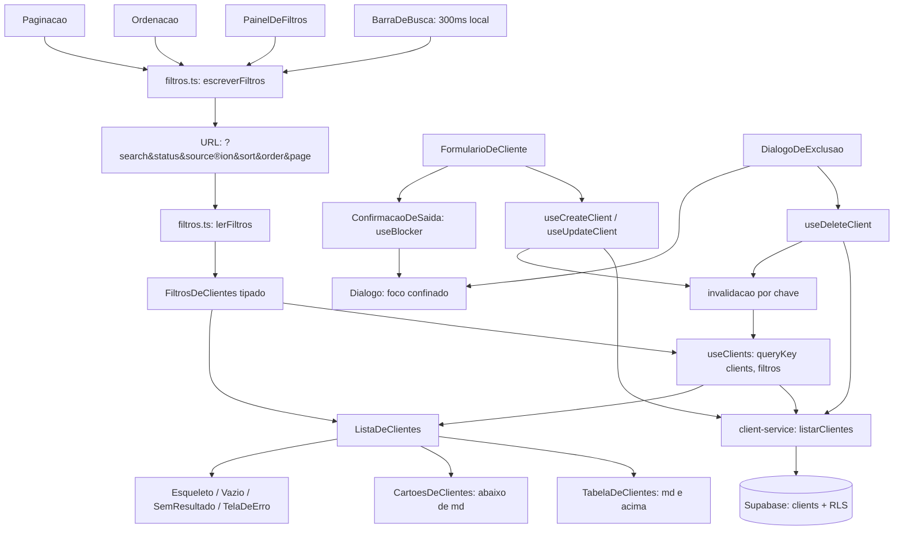

# Clients Design

**Spec**: `.specs/features/clients/spec.md`
**Context**: `.specs/features/clients/context.md`
**Status**: Draft

---

## O que a `foundation` já entregou

Esta feature não precisa de migration. A camada de banco de `clients` foi construída inteira
na `foundation` e está verificada:

| Peça | Onde | Serve a |
| ---- | ---- | ------- |
| Tabela `clients` com nove colunas e oito constraints | `20260915175043_clients.sql:7-37` | CLNT-01, CLNT-03 |
| Trigger `clients_normalize` (apara nome e região, baixa e-mail, reduz telefone a dígitos) | `:45-64` | CLNT-08, edge case da caixa da região |
| Trigger `clients_set_updated_at` | `:71-73` | CLNT-14 (data de atualização na ficha) |
| Grant por coluna, sem `owner_id`, `created_at` e `updated_at` | `:82-85` | CLNT-15 (AD-014) |
| Quatro políticas de RLS, uma por operação | `:88-105` | CLNT-02, CLNT-07, CLNT-14, CLNT-17 |
| Coluna gerada `search_text`, sem acento e em minúsculas, sobre nome, e-mail e telefone | `20260915180608_...:15-23` | CLNT-08 |
| Índice GIN trigram sobre `search_text` | `:40-41` | CLNT-08 e o critério de 500 clientes |
| Cinco índices de filtro, todos com `owner_id` à esquerda | `:28-33` | CLNT-07, CLNT-09, CLNT-11 |
| `notes.client_id ... on delete cascade` | `20260915182431_notes.sql:11` | CLNT-17 AC3 |

Duas consequências diretas no desenho:

1. **A busca dos AC2 e AC3 é um único `ilike` sobre `search_text`**, não um `.or()` de três
   colunas. A coluna já concatena nome, e-mail e telefone sem acento e em minúsculas, e é ela
   que o índice trigram cobre. Um `.or()` de três `ilike` não usaria índice nenhum.
2. **A exclusão em cascata do CLNT-17 AC3 não custa código.** A chave estrangeira de `notes`
   já apaga junto. O que a aplicação faz é confirmar e reagir.

---

## Medições feitas para este desenho

O comportamento de três pontos não estava documentado de forma que eu pudesse deduzir. Medi
contra a pilha local, com uma linha descartável removida em seguida (`clients` voltou a zero).

**1. Escape de curingas atravessa o PostgREST.** O edge case do spec exige que `%` e `_`
digitados sejam literais. Medido via REST com `search_text=ilike.<padrão>`:

| Padrão | Resultado | Leitura |
| ------ | --------- | ------- |
| `%\%%` contra `sonda 100% a_b` | casa | `\%` vira `%` literal |
| `%\_%` contra `a_b` | casa | `\_` vira `_` literal |
| `%c\\d%` contra `c\d` | casa | `\\` vira contrabarra literal |
| `%zz\%%` contra linha sem `%` | vazio | o escape não casa onde não existe |

Logo o escape funciona, e a ordem importa: a contrabarra é escapada **primeiro**, senão ela
escapa o escape que acabamos de inserir.

**2. O `*` é curinga no PostgREST, e não há como torná-lo literal.** Não estava no spec.
`%100*acao%` casou contra `sonda 100% a_b`, com o `*` valendo por "% " — e `%e\*f%` **não**
casou contra `e*f`, porque o PostgREST traduz `*` para `%` antes do SQL, de modo que `\*`
significa "porcentagem literal", não "asterisco literal". Tratamento no desenho abaixo e
emenda proposta ao spec.

**3. `immutable_unaccent` e a normalização em JavaScript concordam em português.**
`public.immutable_unaccent('José Gonçalves ÃÕÜÊ ação')` devolveu `Jose Goncalves AOUE acao` —
o mesmo que `NFD` + remoção de marcas combinantes produz, inclusive o `ç`, que decompõe. A
concordância é medida para o alfabeto português, não provada em geral (ver Riscos).

**4. APIs confirmadas na documentação corrente** (Context7, não memória): `useBlocker` de
`react-router` devolve `state`/`proceed()`/`reset()` e **não** intercepta recarregamento nem
fechamento de aba; `MutationCache({ onError })` dispara para toda mutação e não pode ser
sobrescrito por uma individual; `.select('*', { count: 'exact' })` com `.range(de, ate)`
devolve linhas e total em um request.

---

## Architecture Overview

A URL é a fonte única do estado da listagem. Um módulo puro traduz `URLSearchParams` em
filtros tipados; a chave do TanStack Query deriva desses filtros; mudar um filtro é navegar.
Isso atende os AC6, AC7 e AC8 por construção, e faz os botões de voltar e avançar do navegador
funcionarem sobre as páginas em cache, sem código dedicado.



O fluxo de escrita nunca atualiza a listagem à mão: ele invalida a chave e deixa o TanStack
Query refazer a consulta. É o que mantém um único ponto de invalidação (PLAN §8) e o que faz
o total e a paginação do CLNT-17 AC4 se recalcularem sem cálculo local.

---

## Code Reuse Analysis

### Componentes existentes a aproveitar

| Componente | Local | Como usar |
| ---------- | ----- | --------- |
| `Campo` | `src/components/ui/Campo.tsx` | Importar. Rótulo obrigatório, `aria-describedby` e `aria-invalid` já amarrados — entrega o CLNT-18 AC1 e AC5 de graça |
| `Botao` | `src/components/ui/Botao.tsx` | **Estender** com a variante `destrutiva`. O comentário do arquivo já declara que ela nasce aqui; `enviando` cobre o CLNT-05 AC9 e o CLNT-17 AC8 |
| `Alerta` | `src/components/ui/Alerta.tsx` | Importar. `role="alert"` para erro e `role="status"` para sucesso entregam o CLNT-18 AC7 |
| `TelaDeErro` | `src/components/feedback/TelaDeErro.tsx` | Estado de erro do CLNT-13 AC15 com ação de tentar de novo |
| `Carregando` | `src/components/feedback/Carregando.tsx` | Estado pendente da ficha; os esqueletos do CLNT-13 são novos |
| `AppLayout` + `MenuDoUsuario` | `src/components/layout/AppLayout.tsx` | Já é a moldura de `/clients`; as telas entram como filhas |
| `RotaProtegida` | `src/features/auth/components/RotaProtegida.tsx` | Já envolve `/clients`. Nenhuma rota nova precisa de guarda própria |
| `queryClient` | `src/lib/query-client.ts` | **Estender** com `mutationCache` (D3). `deveTentarDeNovo` já não repete `42501` nem 401 |
| `supabase` | `src/lib/supabase.ts` | Importar. Cliente único, tipado por `Database` |

### Padrões existentes a repetir

| Padrão | Referência | Aplicação |
| ------ | ---------- | --------- |
| Serviço de feature devolvendo união discriminada `{ ok: true } \| { ok: false, mensagem }` nas escritas e lançando nas leituras | `profile-service.ts:25,46` | `client-service.ts` segue a mesma divisão |
| Chave de consulta exportada do serviço, compartilhada por todos os consumidores | `profile-service.ts:13` | `chaves.ts` com fábrica por filtros |
| Tipos derivados do banco, nunca redigitados | `profile-service.ts:5` | `Database['public']['Tables']['clients']['Row']` |
| Módulo puro para lógica de URL, testável sem React | `destino.ts` | `filtros.ts` e `busca.ts` |
| Schemas Zod espelhando as constraints do banco | `auth/schemas.ts` | `clients/schemas.ts` |
| Teste contra a pilha real além do unitário | `tests/rls/clients.test.ts`, `helpers.ts` | Reaproveitar os helpers de usuário para as consultas de listagem |

### Pontos de integração

| Sistema | Integração |
| ------- | ---------- |
| Rota `/clients` | Hoje é o lugar-tenente `App.tsx` (`router.tsx:43-45`). Passa a apontar para `ListaDeClientes`; o comentário do lugar-tenente sai |
| `notes` | `/clients/:id` reserva o ponto onde a lista de notas entra. Esta feature não a implementa |
| RLS | `owner_id` nunca é enviado pela aplicação nos filtros: a política já restringe. Filtrar por ele no cliente daria a impressão falsa de que é o filtro que protege |

---

## Components

### `filtros.ts`

- **Purpose**: Traduzir entre a query string e um objeto de filtros tipado, nas duas direções.
- **Location**: `src/features/clients/filtros.ts`
- **Interfaces**:
  - `lerFiltros(sp: URLSearchParams): FiltrosDeClientes` — aplica padrões, restringe `sort` e
    `order` a valores conhecidos, força `page >= 1`, trata termo só de espaços como vazio
  - `escreverFiltros(f: FiltrosDeClientes): URLSearchParams` — omite o que é padrão, para que
    a URL limpa continue limpa
  - `PADROES: FiltrosDeClientes` — `sort: 'created_at'`, `order: 'desc'`, `page: 1`
- **Dependencies**: nenhuma. Sem React, sem Supabase.
- **Reuses**: o formato de `destino.ts`, que já resolve uma questão de URL em módulo puro.

### `busca.ts`

- **Purpose**: Transformar o que o consultor digitou no padrão que vai ao `ilike`.
- **Location**: `src/features/clients/busca.ts`
- **Interfaces**:
  - `normalizarTermo(bruto: string): string` — apara, colapsa espaços, remove acentos por
    `NFD`, baixa a caixa
  - `escaparCuringas(termo: string): string` — escapa `\`, `%` e `_`, **nessa ordem**
  - `soDigitos(termo: string): string` — para o AC3
  - `padroesDeBusca(bruto: string): string[]` — devolve um padrão para o texto e, quando o
    termo contiver dígitos, um segundo para o telefone
- **Dependencies**: nenhuma.
- **Reuses**: nada; é lógica nova, e é onde as medições 1 a 3 ficam presas por teste.

### `schemas.ts`

- **Purpose**: Validar o formulário com as mesmas regras que o banco impõe.
- **Location**: `src/features/clients/schemas.ts`
- **Interfaces**:
  - `schemaDeCliente` — `name` 2 a 120; `email` opcional com formato; `phone` opcional, 8 a 20
    dígitos depois de retirar a máscara; `region` até 80; `income` entre 0 e 99.999.999,99;
    `status`, `source` e `income_type` restritos aos valores do check
  - `DadosDeCliente` — tipo inferido
  - `STATUS`, `ORIGENS`, `TIPOS_DE_RENDA` — pares valor/rótulo em português, alimentando as
    seleções do CLNT-03 sem repetir literal em cada tela
- **Dependencies**: `zod`
- **Reuses**: a forma de `auth/schemas.ts`. Os limites saem das constraints da migration, não
  de invenção — cada um tem contraparte em `clients_*_check`.

### `client-service.ts`

- **Purpose**: Único lugar que fala com a tabela `clients`.
- **Location**: `src/features/clients/services/client-service.ts`
- **Interfaces**:
  - `listarClientes(f: FiltrosDeClientes): Promise<{ clientes: Cliente[]; total: number }>` —
    um request com `count: 'exact'` e `.range()`
  - `buscarCliente(id: string): Promise<Cliente>` — propaga o erro; não fabrica cliente vazio
  - `criarCliente(d: DadosDeCliente): Promise<ResultadoDeEscrita>` — envia `owner_id` do
    usuário autenticado, exigido pelo `with check` da política
  - `atualizarCliente(id: string, d: DadosDeCliente): Promise<ResultadoDeEscrita>` — envia
    somente as oito colunas do grant de update
  - `excluirCliente(id: string): Promise<ResultadoDeEscrita>`
  - `listarRegioes(): Promise<string[]>` — `select('region')`, agrupado por `lower()` em JS e
    ordenado
- **Dependencies**: `supabase`, `filtros.ts`, `busca.ts`
- **Reuses**: `profile-service.ts` como molde — leituras lançam, escritas devolvem união
  discriminada.

### `hooks/` — `useClients`, `useClient`, `useRegioes`, `useCreateClient`, `useUpdateClient`, `useDeleteClient`

- **Purpose**: Ligar os serviços ao cache, com a invalidação em um lugar só.
- **Location**: `src/features/clients/hooks/`
- **Interfaces**: os nomes são os que o PLAN §8 fixa. `useClients` recebe os filtros já lidos
  da URL e usa `placeholderData` para manter a página anterior visível durante a troca, em vez
  de piscar esqueleto a cada paginada. As três mutações invalidam `['clients']` inteiro; a de
  update e a de delete invalidam também `['cliente', id]`.
- **Dependencies**: `@tanstack/react-query`, `client-service.ts`, `chaves.ts`
- **Reuses**: a convenção de chave compartilhada de `CHAVE_DO_PERFIL`.

### `Dialogo`

- **Purpose**: Diálogo modal acessível, usado pela exclusão e pela confirmação de saída.
- **Location**: `src/components/ui/Dialogo.tsx`
- **Interfaces**: `aberto`, `titulo`, `descricao`, `children`, `aoFechar()` — move o foco para
  dentro ao abrir, confina a tabulação, fecha no Escape e devolve o foco à origem ao fechar.
- **Dependencies**: nenhuma além de React.
- **Reuses**: nada. É o componente que entrega o CLNT-18 AC3 e AC4, e existe em `ui/` porque
  tem dois consumidores desde o primeiro dia — a exclusão e a saída com alterações pendentes.

### `Selecao` e `CampoComSugestoes`

- **Purpose**: `Selecao` é o par de `Campo` para `select`; `CampoComSugestoes` é o campo de
  região com as regiões já usadas.
- **Location**: `src/components/ui/`
- **Interfaces**: mesmas props de rótulo, erro e dica de `Campo`, para que os três se
  comportem igual no formulário.
- **Reuses**: `Campo` como referência de acessibilidade; `CampoComSugestoes` aceita uma nova
  região, pois AD-009 não fecha a lista.

### Telas

| Tela | Local | Rota |
| ---- | ----- | ---- |
| `ListaDeClientes` | `src/features/clients/pages/ListaDeClientes.tsx` | `/clients` |
| `NovoCliente` | `.../NovoCliente.tsx` | `/clients/new` |
| `FichaDoCliente` | `.../FichaDoCliente.tsx` | `/clients/:id` |
| `EditarCliente` | `.../EditarCliente.tsx` | `/clients/:id/edit` |

`FormularioDeCliente` é um componente só, consumido pelas duas telas de escrita — é o que o
CLNT-15 AC3 exige ao pedir "o mesmo formulário do cadastro, pré-preenchido".

---

## Data Models

```typescript
export type Cliente = Database['public']['Tables']['clients']['Row']

export type OrdenacaoDeClientes = 'name' | 'created_at'

export type FiltrosDeClientes = {
  busca: string
  status: string | null
  origem: string | null
  regiao: string | null
  sort: OrdenacaoDeClientes
  order: 'asc' | 'desc'
  page: number
}

export type ResultadoDeEscrita =
  | { ok: true; cliente: Cliente }
  | { ok: false; mensagem: string }
```

`Cliente` inclui `search_text`, que é coluna gerada: aparece na leitura e nunca é escrita.

**Relacionamentos**: `clients.owner_id` → `auth.users.id` (cascade); `notes.client_id` →
`clients.id` (cascade). Nenhum dos dois é manipulado pela aplicação.

---

## Error Handling Strategy

| Cenário | Tratamento | O que o consultor vê |
| ------- | ---------- | -------------------- |
| Consulta da listagem falha | `TelaDeErro` com ação de tentar de novo; filtros preservados na URL | Estado de erro, e a lista volta ao clicar em tentar de novo |
| `id` inexistente ou de outro dono | A RLS devolve zero linhas; a tela trata como não encontrado | "Cliente não encontrado", com retorno à listagem, sem revelar se existe |
| 401 ou 403 em leitura | `aoFalharConsulta` já ligado ao `QueryCache` | Login com "Sua sessão expirou", rota preservada |
| 401 ou 403 em **escrita** | `mutationCache.onError` novo (D3) | Mesmo caminho da leitura, em vez de mensagem genérica |
| `42501` em escrita | Não é expiração (`ehSessaoExpirada` é estreita de propósito); o formulário exibe erro de permissão | Mensagem no formulário, sessão intacta — é o AUTH-12 AC4, que só agora tem tela capaz de originá-lo |
| Constraint do banco violada | Serviço devolve `{ ok: false, mensagem }`; formulário preserva o que foi digitado | Alerta de erro acima do formulário, dados intactos |
| Falha de rede | `deveTentarDeNovo` repete duas vezes e desiste | Estado de erro com tentar de novo; sem fila offline |
| Exclusão falha | Registro permanece visível; diálogo exibe o erro | O cliente continua na lista, com a mensagem |
| Página da URL além do total | `lerFiltros` não pode saber o total; a tela redireciona para a última página ao receber a resposta | Última página existente |

---

## Risks & Concerns

| Concern | Local | Impacto | Mitigação |
| ------- | ----- | ------- | ---------- |
| O `*` é curinga no PostgREST e não há como torná-lo literal (medição 2) | `busca.ts` (a nascer) | Quem digitar `*` recebe mais resultados que o esperado; o edge case do spec fica cumprido para `%` e `_` e não para `*` | Escapar `\`, `%` e `_`; **emendar o spec** acrescentando o `*` ao edge case com o comportamento medido, e prender a medição num teste, de modo que uma mudança futura do PostgREST derrube a suíte. Fechar de verdade exigiria trocar `.ilike()` por RPC com o termo em parâmetro — desproporcional ao MVP |
| Concordância entre `immutable_unaccent` e `NFD` medida só para o português (medição 3) | `busca.ts` × `20260915180608_...:15-23` | Um caractere fora do alfabeto português pode normalizar diferente nos dois lados e a busca não casar | Teste com `ç`, `ã`, `õ`, `ü`, `ê` contra a pilha real, não apenas unitário. Divergência exótica fica como limitação conhecida, não como bug silencioso |
| `mutationCache` global é acrescentado a `query-client.ts`, que hoje tem apenas `queryCache` | `src/lib/query-client.ts:68-69` | Se a ligação for feita e ninguém testar o caminho, a falha volta a ser silenciosa — foi exatamente o que o D3 registrou | Teste que assere `queryClient.getMutationCache().config.onError === aoFalharConsulta`, no mesmo formato de `query-client.test.ts:128`, que já faz isso para o `QueryCache` |
| `listarRegioes` lê uma coluna de todas as linhas do consultor | `client-service.ts` (a nascer) | Com 500 clientes são poucos KB, mas cresce linearmente e é chamada em toda abertura da listagem | Consulta própria com `staleTime` longo, invalidada só pelas três mutações. O RPC com `distinct on` fica registrado como caminho de evolução, com o índice `(owner_id, lower(region))` já pronto para ele |
| L-001 (confirmada): política e grant cobrindo o mesmo caso fazem o teste passar pelo motivo errado | `clients` tem grant de update de oito colunas mais quatro políticas | Um teste de escrita pode passar pela camada errada, como aconteceu em `profiles` | Nas escritas, asserir o payload por igualdade **profunda** e, no teste contra a pilha real, verificar o `42501` de uma coluna fora do grant — as duas camadas, como a correção de `auth` fez |
| `App.tsx` é o lugar-tenente de `/clients` e será substituído | `src/app/router.tsx:43-45`, `src/app/App.test.tsx` | O teste de rotas afirma hoje que `/clients` renderiza o lugar-tenente; trocar sem ajustar deixa um teste que protege o passado | A tarefa de fiação atualiza `router.test.tsx` na mesma mudança, e o teste de `App` sai junto com o componente se ele deixar de existir |
| `useBlocker` não intercepta recarregamento nem fechamento de aba (medição 4) | `ConfirmacaoDeSaida` (a nascer) | O CLNT-06 fica cumprido para navegação interna e não para fechar a aba, que é o gesto mais comum de perder dados | Registrado aqui e no spec como limite conhecido. Um `beforeunload` fecharia a lacuna em três linhas; fica fora por ora porque atrapalha o E2E e não foi pedido |
| `staleTime` global de 30s | `src/lib/query-client.ts:76` | Editar em duas abas pode mostrar dado velho por até 30s na aba que não escreveu | Aceito: a invalidação cobre a aba que escreveu, que é o caso real de um produto de usuário único |

---

## Tech Decisions

| Decisão | Escolha | Racional |
| ------- | ------- | -------- |
| Onde vive o estado da listagem | URL como fonte única, lida por `useSearchParams` e traduzida por módulo puro | Atende AC6, AC7 e AC8 por construção, em vez de por sincronização. Duas fontes de verdade é o desenho onde a dessincronia nasce |
| Onde o 401 de escrita é tratado | `mutationCache.onError` global, simétrico ao `queryCache` | A documentação garante disparo para toda mutação, sem poder ser esquecido por uma nova. Fecha o D3 de `auth` junto |
| Origem das regiões do filtro | `select('region')` com agrupamento por `lower()` no cliente | Zero SQL novo, nenhuma migration, nenhum pgTAP. O RPC fica como evolução medida, não como suposição |
| Tabela contra cartões | Duas árvores irmãs alternadas por classe utilitária (`hidden md:block` e `md:hidden`) | O AC10 fala em viewport. Fazer por CSS evita ouvir `matchMedia` em JavaScript e funciona no primeiro quadro, sem salto de layout |
| Como a busca vira padrão de `ilike` | Um `ilike` sobre `search_text`, com termo normalizado e curingas escapados | A coluna gerada e o índice trigram já existem. `.or()` de três colunas não usaria índice |
| Confirmação de saída | `useBlocker` mais `Dialogo` | O `Dialogo` já nasce para a exclusão; o custo marginal é o hook |
| Variante destrutiva do botão | Acrescentada a `Botao` | O próprio arquivo declara que ela nasce nesta feature, junto da exclusão que a exige |
| Mudança de status | Só pelo formulário de edição | Mantém um caminho único de escrita. Decisão do usuário nesta fase, confirmando a premissa do spec |

> **Decisões de nível de projeto**: duas destas fixam convenção além de `clients` e foram
> registradas em `.specs/STATE.md` como **AD-015** (URL como fonte única do estado de
> listagem) e **AD-016** (tratamento global de falha de autorização nas mutações).

---

## Cobertura dos requisitos

| Requisito | Onde é atendido |
| --------- | --------------- |
| CLNT-01 | `schemas.ts`, `FormularioDeCliente` |
| CLNT-02 | `client-service.criarCliente` com `owner_id` do usuário autenticado |
| CLNT-03 | `STATUS`, `ORIGENS`, `TIPOS_DE_RENDA` + `Selecao` |
| CLNT-04 | `listarRegioes` + `CampoComSugestoes` |
| CLNT-05 | `Botao enviando` + união discriminada do serviço |
| CLNT-06 | `ConfirmacaoDeSaida` (`useBlocker` + `Dialogo`) |
| CLNT-07 | `listarClientes` com `count: 'exact'` e `.range()` |
| CLNT-08 | `busca.ts` + `ilike` sobre `search_text` |
| CLNT-09 | `filtros.ts` + `.eq()` por status, origem e região |
| CLNT-10 | `filtros.ts` nas duas direções, com `useSearchParams` |
| CLNT-11 | `sort` e `order` restritos em `lerFiltros`, aplicados por `.order()` |
| CLNT-12 | `TabelaDeClientes` e `CartoesDeClientes` alternadas por classe |
| CLNT-13 | `Esqueleto`, estado inicial, sem resultado e `TelaDeErro` |
| CLNT-14 | `FichaDoCliente` + `buscarCliente` que propaga erro |
| CLNT-15 | `FormularioDeCliente` pré-preenchido + `atualizarCliente` nas oito colunas do grant |
| CLNT-16 | `DialogoDeExclusao` sobre `Dialogo`, com `Botao destrutiva` |
| CLNT-17 | `excluirCliente` + invalidação; cascata pela chave estrangeira |
| CLNT-18 | `Campo`, `Selecao`, `Dialogo`, `Alerta` e o recuo de página |

Os dezoito requisitos têm destino. Nenhum componente existe sem requisito que o exija.
