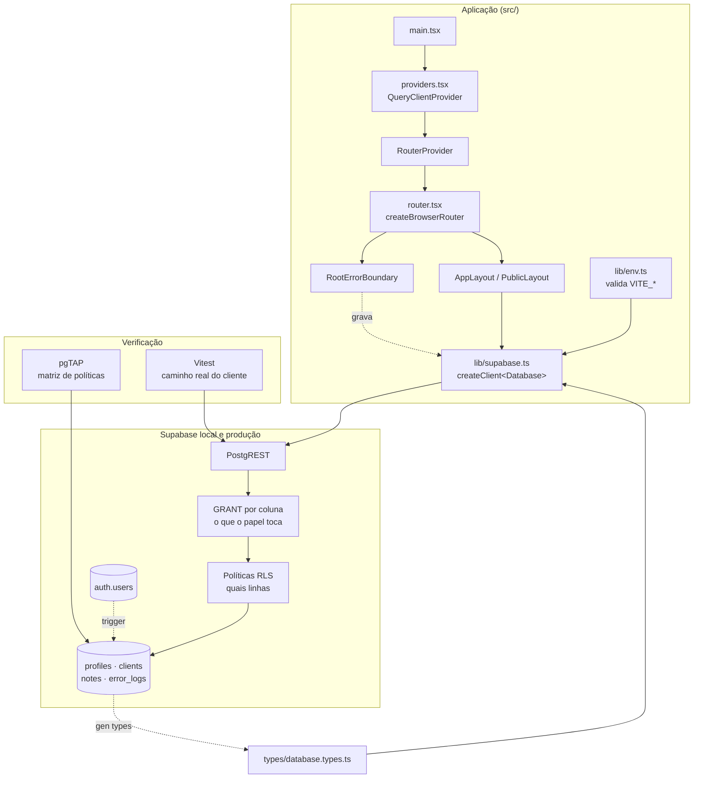

# Foundation Design

**Spec**: `.specs/features/foundation/spec.md`
**Context**: `.specs/features/foundation/context.md`
**Status**: Approved

---

## Architecture Overview

A feature tem duas metades quase independentes que se encontram em um único artefato: `database.types.ts`.

A metade de baixo é o banco, descrito por migrations escritas à mão. Ela carrega a regra de autorização inteira do produto: como o frontend fala direto com o Supabase (AD-001), nenhuma camada de aplicação se interpõe entre o navegador e o Postgres. A consequência de desenho é que as garantias não podem depender de política apenas — cada uma é sustentada por dois mecanismos independentes: um `grant` no nível de coluna que define *o que o papel pode tocar*, e uma política de RLS que define *quais linhas*. Um erro em qualquer um dos dois ainda deixa o outro de pé.

A metade de cima é o esqueleto do app: validação de ambiente que falha cedo, o cliente Supabase tipado, o roteador em data mode, o layout base e o error boundary.



### Ordem das migrations

A ordem é imposta por dependência, não por gosto. Funções compartilhadas primeiro; o trigger em `auth.users` por último, porque ele escreve em `profiles`.

| # | Arquivo | Conteúdo |
| - | ------- | -------- |
| 1 | `..._extensions_and_helpers.sql` | `pg_trgm`, `unaccent`, `public.set_updated_at()`, `public.immutable_unaccent()` |
| 2 | `..._profiles.sql` | tabela, constraints, trigger, grants, RLS, políticas |
| 3 | `..._clients.sql` | tabela, constraints, triggers, coluna gerada de busca, índices, grants, RLS, políticas |
| 4 | `..._notes.sql` | tabela, constraints, trigger, índice, grants, RLS, políticas |
| 5 | `..._error_logs.sql` | tabela, constraints, índice, grant de insert, RLS, política |
| 6 | `..._handle_new_user.sql` | função `security definer` e trigger em `auth.users` |

Nomes reais recebem o prefixo de timestamp gerado por `supabase migration new <nome>`.

---

## Code Reuse Analysis

### Existing Components to Leverage

O repositório contém apenas `PLAN.md` e `.specs/`. Não há código a reaproveitar — esta feature é o ponto de origem de todos os padrões que as demais vão seguir.

| Componente | Origem | Como é usado |
| ---------- | ------ | ------------ |
| `set_updated_at()` | criado aqui | Reusado pelos triggers de `profiles`, `clients` e `notes` |
| Forma canônica de política | criada aqui | `(select auth.uid())` + `to authenticated`, replicada em toda tabela (AD-003) |
| `AppLayout` | criado aqui | Consumido por todas as rotas privadas de `auth`, `clients` e `notes` |
| `lib/supabase.ts` | criado aqui | Cliente único e tipado, importado por todos os serviços de feature |
| Padrão de serviço por feature | estabelecido aqui | `features/*/services/*-service.ts`, conforme PLAN §8 |

### Integration Points

| Sistema | Método de integração |
| ------- | -------------------- |
| Supabase Auth | `auth.users` referenciada por FK em `profiles`, `clients` e `error_logs`; trigger `after insert` popula `profiles` |
| PostgREST | Único canal de dados do app; a exposição é controlada por `grant` explícito, nunca pelo padrão |
| Supabase CLI | `db reset`, `migration new`, `gen types`, `test db` — todos scripts de `package.json` |
| Vercel | Consome apenas o build do Vite; sem acoplamento nesta feature (ver `deploy`) |

---

## Components

### `lib/env.ts`

- **Purpose**: Valida as variáveis `VITE_*` na carga do módulo e falha nomeando a que estiver faltando.
- **Location**: `src/lib/env.ts`
- **Interfaces**:
  - `env: { VITE_SUPABASE_URL: string; VITE_SUPABASE_ANON_KEY: string }` — objeto congelado, já validado
- **Dependencies**: Zod
- **Reuses**: nada — é o primeiro módulo a carregar
- **Nota**: a validação é feita com um schema Zod avaliado em tempo de importação. O erro de um `parse` que falha já nomeia a chave ausente, o que atende FND-03 sem mensagem escrita à mão.

### `lib/supabase.ts`

- **Purpose**: Expõe a única instância do cliente Supabase, tipada pelo schema gerado.
- **Location**: `src/lib/supabase.ts`
- **Interfaces**:
  - `supabase: SupabaseClient<Database>`
- **Dependencies**: `@supabase/supabase-js`, `lib/env.ts`, `types/database.types.ts`
- **Reuses**: `env` — nunca lê `import.meta.env` diretamente, para que a validação não tenha como ser contornada

### `lib/query-client.ts`

- **Purpose**: Configura o `QueryClient` do TanStack Query com os padrões do projeto.
- **Location**: `src/lib/query-client.ts`
- **Interfaces**:
  - `queryClient: QueryClient`
- **Dependencies**: `@tanstack/react-query`
- **Reuses**: nada
- **Nota**: `retry` é desligado para erros de autorização, para que uma sessão expirada não vire três tentativas antes de o usuário ver a mensagem. A feature `auth` conecta o tratamento de expiração neste mesmo ponto.

### `app/router.tsx`

- **Purpose**: Define a árvore de rotas em data mode.
- **Location**: `src/app/router.tsx`
- **Interfaces**:
  - `router: DataRouter` — criado por `createBrowserRouter`, fora da árvore React
- **Dependencies**: `react-router`, componentes de layout
- **Reuses**: `AppLayout`, `PublicLayout`, `RootErrorBoundary`
- **Nota**: nenhum `loader` é usado. Os dados continuam inteiramente com o TanStack Query (PLAN §8); o roteador cuida só de rotas, layouts aninhados e fronteiras de erro. Em `foundation` a árvore tem apenas a raiz, um placeholder e a rota de não encontrado — `auth`, `clients` e `notes` acrescentam as suas.

### `app/providers.tsx`

- **Purpose**: Compõe os provedores globais em uma ordem única e explícita.
- **Location**: `src/app/providers.tsx`
- **Interfaces**:
  - `<AppProviders>{children}</AppProviders>`
- **Dependencies**: `queryClient`
- **Reuses**: `lib/query-client.ts`
- **Nota**: `auth` insere o seu provedor de sessão aqui, por dentro do `QueryClientProvider`, porque a limpeza de cache na expiração de sessão precisa alcançar o cliente de query.

### `components/feedback/RootErrorBoundary.tsx`

- **Purpose**: Captura o que escapa da árvore, mostra tela de erro com ação de recarregar e registra a falha quando há sessão.
- **Location**: `src/components/feedback/RootErrorBoundary.tsx`
- **Interfaces**:
  - Componente de classe com `componentDidCatch(error, info)`
  - `logClientError(error: Error, route: string): Promise<void>` — em `src/lib/error-log.ts`
- **Dependencies**: `lib/supabase.ts`
- **Reuses**: cliente Supabase
- **Nota**: `logClientError` resolve sempre, engolindo o próprio erro de gravação — FND-16 exige que a falha de log não gere uma segunda exceção. Sem sessão, ela nem tenta escrever (AD-011).

### `components/layout/AppLayout.tsx` e `PublicLayout.tsx`

- **Purpose**: Moldura das rotas privadas e das públicas.
- **Location**: `src/components/layout/`
- **Interfaces**: componentes de rota, renderizam `<Outlet />`
- **Dependencies**: `react-router`
- **Reuses**: tokens de `styles/globals.css`
- **Nota**: `AppLayout` já reserva o espaço do cabeçalho com nome do usuário e ação de sair; `auth` preenche esse espaço em AUTH-15.

### `styles/globals.css`

- **Purpose**: Importa o Tailwind v4 e declara os tokens de design.
- **Location**: `src/styles/globals.css`
- **Interfaces**: `@import "tailwindcss";` seguido de um bloco `@theme`
- **Dependencies**: `@tailwindcss/vite`
- **Reuses**: nada
- **Nota**: não existe `tailwind.config.js` (AD-010). Os tokens viram variáveis CSS nativas, o que permite usá-los fora das classes utilitárias.

---

## Data Models

### `profiles`

```sql
create table public.profiles (
  id          uuid primary key references auth.users (id) on delete cascade,
  full_name   text not null,
  email       text not null,
  phone       text,
  created_at  timestamptz not null default now(),
  updated_at  timestamptz not null default now(),
  constraint profiles_full_name_length check (char_length(full_name) between 1 and 120),
  constraint profiles_email_length     check (char_length(email) <= 254),
  constraint profiles_phone_digits     check (phone is null or phone ~ '^[0-9]{8,20}$')
);
```

**Relationships**: 1:1 com `auth.users`. A linha nasce pelo trigger e morre pela cascata.

### `clients`

```sql
create table public.clients (
  id          uuid primary key default gen_random_uuid(),
  owner_id    uuid not null references auth.users (id) on delete cascade,
  name        text not null,
  email       text,
  phone       text,
  status      text not null default 'lead',
  source      text,
  region      text,
  income      numeric(12,2),
  income_type text,
  created_at  timestamptz not null default now(),
  updated_at  timestamptz not null default now(),

  constraint clients_name_length        check (char_length(name) between 2 and 120),
  constraint clients_email_length       check (email is null or char_length(email) <= 254),
  constraint clients_email_format       check (email is null or email ~ '^[^@[:space:]]+@[^@[:space:]]+\.[^@[:space:]]+$'),
  constraint clients_phone_digits       check (phone is null or phone ~ '^[0-9]{8,20}$'),
  constraint clients_region_length      check (region is null or char_length(region) between 1 and 80),
  constraint clients_status_allowed     check (status in ('lead','contacted','qualified','client','inactive')),
  constraint clients_source_allowed     check (source is null or source in ('indication','instagram','website','whatsapp','portal','other')),
  constraint clients_income_type_allowed check (income_type is null or income_type in ('formal','informal','mixed')),
  constraint clients_income_range       check (income is null or (income >= 0 and income <= 99999999.99))
);
```

Mais uma coluna gerada, que é o que torna a busca da feature `clients` possível sem varredura:

```sql
alter table public.clients
  add column search_text text
  generated always as (
    public.immutable_unaccent(
      lower(coalesce(name,'') || ' ' || coalesce(email,'') || ' ' || coalesce(phone,''))
    )
  ) stored;
```

**Relationships**: N:1 com `auth.users` por `owner_id`; 1:N com `notes`.

### `notes`

```sql
create table public.notes (
  id          uuid primary key default gen_random_uuid(),
  client_id   uuid not null references public.clients (id) on delete cascade,
  title       text not null,
  description text,
  created_at  timestamptz not null default now(),
  updated_at  timestamptz not null default now(),
  constraint notes_title_length       check (char_length(btrim(title)) between 1 and 120),
  constraint notes_description_length check (description is null or char_length(description) <= 5000)
);
```

**Relationships**: N:1 com `clients`. Sem `owner_id` próprio — a propriedade é derivada do cliente (AD-004).

### `error_logs`

```sql
create table public.error_logs (
  id         uuid primary key default gen_random_uuid(),
  owner_id   uuid not null references auth.users (id) on delete cascade,
  message    text not null,
  stack      text,
  route      text,
  user_agent text,
  created_at timestamptz not null default now(),
  constraint error_logs_message_length check (char_length(message) between 1 and 2000),
  constraint error_logs_stack_length   check (stack is null or char_length(stack) <= 10000),
  constraint error_logs_route_length   check (route is null or char_length(route) <= 500)
);
```

**Relationships**: N:1 com `auth.users`. É a única tabela sem grant de `select` para `authenticated` — escreve-se nela, não se lê dela pelo app.

### Índices

| Índice | Serve a |
| ------ | ------- |
| `clients (owner_id, created_at desc)` | Listagem padrão e paginação |
| `clients (owner_id, name)` | Ordenação alternativa por nome |
| `clients (owner_id, status)` | Filtro de status |
| `clients (owner_id, source)` | Filtro de origem |
| `clients (owner_id, lower(region))` | Filtro de região e montagem das opções distintas |
| `clients (id, owner_id)` | Torna o `exists` das políticas de `notes` um index-only scan |
| `clients using gin (search_text extensions.gin_trgm_ops)` | Busca parcial por nome, e-mail ou telefone |
| `notes (client_id, created_at desc)` | Lista de notas da ficha e cascata da exclusão |
| `error_logs (owner_id, created_at desc)` | Inspeção manual por usuário e período |

Todo índice de filtro tem `owner_id` como coluna mais à esquerda. O motivo é que a RLS injeta `owner_id = auth.uid()` em toda consulta: um índice isolado em `status` nunca seria a melhor escolha do planner, porque a igualdade em `owner_id` está sempre presente e é muito mais seletiva.

### Funções e triggers

| Objeto | Tipo | Papel |
| ------ | ---- | ----- |
| `public.set_updated_at()` | trigger `before update` | Escreve `now()` em `updated_at`, descartando o que vier do cliente |
| `public.normalize_client()` | trigger `before insert or update` | Apara o nome, normaliza o e-mail para minúsculas, reduz o telefone a dígitos, apara e colapsa a região, converte vazio em nulo |
| `public.normalize_note()` | trigger `before insert or update` | Apara o título e converte descrição só de espaços em nulo |
| `public.immutable_unaccent(text)` | função `immutable` | Envelope determinístico de `unaccent`, exigido para indexar a coluna gerada |
| `public.handle_new_user()` | trigger `after insert` em `auth.users` | Cria a linha em `profiles` (AD-005) |

Triggers `before` rodam antes da avaliação das constraints, o que é o que permite ao `normalize_client` reduzir o telefone a dígitos *antes* de `clients_phone_digits` julgar o valor.

### Forma canônica das políticas

Toda tabela recebe o mesmo par de mecanismos. `clients` como exemplo:

```sql
alter table public.clients enable row level security;

revoke all on public.clients from anon, authenticated;
grant select, insert, delete on public.clients to authenticated;
grant update (name, email, phone, status, source, region, income, income_type)
  on public.clients to authenticated;

create policy clients_select_own on public.clients
  for select to authenticated
  using (owner_id = (select auth.uid()));

create policy clients_insert_own on public.clients
  for insert to authenticated
  with check (owner_id = (select auth.uid()));

create policy clients_update_own on public.clients
  for update to authenticated
  using (owner_id = (select auth.uid()))
  with check (owner_id = (select auth.uid()));

create policy clients_delete_own on public.clients
  for delete to authenticated
  using (owner_id = (select auth.uid()));
```

O grant de `update` por coluna é o que sustenta FND-10: `owner_id`, `created_at` e `updated_at` ficam fora da lista, então não há update que os alcance — a garantia é estrutural, não depende de a política estar certa. O mesmo vale em `profiles`, onde o grant cobre apenas `full_name` e `phone`, o que implementa AD-008 no banco em vez de na tela.

As políticas de `notes` repetem a verificação de dono em cada uma das quatro operações:

```sql
using (
  exists (
    select 1 from public.clients c
    where c.id = notes.client_id
      and c.owner_id = (select auth.uid())
  )
)
```

---

## Error Handling Strategy

| Cenário | Tratamento | Impacto para o usuário |
| ------- | ---------- | ---------------------- |
| Variável `VITE_*` ausente | `lib/env.ts` lança na importação, nomeando a chave | App não inicia; o desenvolvedor vê a chave faltante, não um erro de rede sem contexto |
| Erro não tratado na árvore React | `RootErrorBoundary` renderiza tela de erro com recarregar | Tela explicativa em vez de página em branco |
| Falha ao gravar em `error_logs` | `logClientError` captura e descarta o próprio erro | Nenhum; a tela de erro segue como estava |
| Erro fora de sessão autenticada | Apenas `console.error`, sem tentativa de escrita | Nenhum; a tabela não é exposta a `anon` |
| Violação de check constraint | PostgREST devolve `23514`; o mapeador traduz para mensagem por campo | Mensagem no campo, não erro cru de banco |
| Violação de política de RLS | Insert recusado com `42501`; update e delete afetam zero linhas | Tratado por `auth` como sessão expirada ou por `clients` como não encontrado |
| Falha do trigger de perfil | Aborta a transação de cadastro inteira | Cadastro falha; nenhum usuário órfão sem perfil |
| Supabase local fora do ar nos testes | Setup dos testes verifica e falha com mensagem explícita | Mensagem dizendo para rodar `supabase start` |

---

## Risks & Concerns

| Concern | Onde | Impacto | Mitigação |
| ------- | ---- | ------- | ---------- |
| O trigger em `auth.users` é ponto único de falha do cadastro (AD-005) | `..._handle_new_user.sql` | Qualquer exceção dentro dele impede criar contas, e o erro chega como falha genérica de banco | Função mantida deliberadamente trivial — um insert e nada mais. `coalesce` cobre metadados ausentes. Teste pgTAP cobre com e sem `full_name` |
| Paginação por `OFFSET` contraria a recomendação de keyset do Supabase | Consumida por `clients` | Páginas profundas ficam progressivamente mais caras | O índice `(owner_id, created_at desc)` torna páginas rasas baratas, e a carteira de um consultor não atinge profundidade relevante. Registrado como ponto de revisão se o volume crescer; a decisão de produto está aprovada |
| `unaccent()` é `stable`, não `immutable`, e portanto não pode ser indexada diretamente | `..._extensions_and_helpers.sql` | Sem envelope, a coluna gerada não é criável e a busca sem acento não é indexável | Envelope `public.immutable_unaccent(text)` usando a forma de dois argumentos com dicionário explícito, que é determinística |
| Classe de operador do `pg_trgm` depende do schema onde a extensão vive | `..._clients.sql` | Migration falha ou índice não é usado se o `search_path` não incluir `extensions` | O índice qualifica explicitamente `extensions.gin_trgm_ops` |
| `auth.uid()` lê a claim da sessão por um nome que variou entre versões | `supabase/tests/database/*.test.sql` | Um teste pgTAP pode passar por engano se a claim não for lida | Os testes definem `request.jwt.claims` e `request.jwt.claim.sub`, e a primeira asserção de cada arquivo confirma que `auth.uid()` devolve o usuário esperado antes de qualquer outra |
| A coluna gerada `search_text` é reescrita a cada update da linha | `clients` | Escrita marginalmente mais cara e linha maior | Deriva de três colunas curtas; o custo é irrelevante frente a varrer a tabela em toda busca |
| A chave publicável do Supabase está no bundle | `lib/supabase.ts` | Qualquer pessoa pode chamar a API do projeto com o papel `anon` | `revoke all ... from anon` em todas as quatro tabelas, mais RLS. `anon` não tem grant algum em nenhuma delas |
| RLS é verificada contra o banco local, não o de produção | suíte de testes | Uma migration aplicada parcialmente em produção passaria despercebida | Coberto por DEP-05 e DEP-08 na feature `deploy` |
| Nenhuma execução automatizada da suíte antes de publicar | projeto | Uma regressão de RLS pode chegar em produção | Reconhecido e adiado: CI está fora de escopo em `deploy`. A mitigação atual é o gate por tarefa exigido pelo próprio fluxo |

---

## Tech Decisions

| Decisão | Escolha | Justificativa |
| ------- | ------- | ------------- |
| Autorização em duas camadas | `grant` por coluna **mais** política de RLS | Uma política errada é uma brecha. Com o grant de update restrito a colunas específicas, `owner_id` e `created_at` ficam inalcançáveis mesmo que a política falhe — atende FND-10 estruturalmente |
| Política de `notes` | `exists` repetido nas quatro políticas, sem função auxiliar | Considerei uma função `security definer` em schema privado, como sugerem as práticas do Supabase. Rejeitada aqui: o argumento varia por linha, então ela não elimina o custo por linha, e trocar quatro cláusulas idênticas e legíveis por uma indireção `security definer` piora a auditabilidade do único ponto onde a segurança do produto vive |
| Chave primária | `uuid` com `gen_random_uuid()` | `id` previsível em URL pública de CRM expõe contagem e permite enumeração. O custo de índice maior é irrelevante nesta escala |
| Busca sem acento | Coluna gerada `search_text` mais índice GIN de trigrama | Uma expressão `ilike` sobre `unaccent(...)` em tempo de consulta não usa índice. A coluna gerada paga o custo na escrita, que é rara, em vez de na leitura, que é constante. Amplia FND-07, que pedia GIN sobre `name` e `email`, para cobrir também `phone` — é o que torna a busca por telefone da feature `clients` viável |
| Normalização no banco, não só no formulário | Triggers `before` | O frontend não é a autoridade (PLAN §9). Normalizar no banco garante que dado inserido por qualquer caminho obedeça à mesma regra |
| Domínios controlados | `check constraint` sobre `text` | Conforme AD-006 |
| `error_logs` sem grant de `select` | Insert-only para `authenticated` | Log de erro é escrita de mão única. Sem grant de leitura, nem uma política mal escrita expõe stack traces de outro usuário |
| Roteador | `createBrowserRouter` sem `loader` | Layouts aninhados e `ErrorBoundary` por rota atendem FND-15 e FND-16. Os loaders são deliberadamente não usados para não criar um segundo cache convivendo com o TanStack Query (PLAN §8) |
| Guarda de rota | Componente na árvore, não middleware de rota | A guarda precisa de três estados, e o terceiro é "carregando" — um middleware só sabe redirecionar ou deixar passar, e é exatamente o redirecionamento prematuro que o PLAN §6 proíbe. Implementada em `auth`; `foundation` apenas reserva o ponto de encaixe |
| Divisão da suíte de isolamento | pgTAP para a matriz, Vitest para o caminho real | pgTAP escreve a matriz completa com `set local role` e rollback automático, inclusive a negação para `anon`, que é desajeitada de expressar por cliente autenticado. Vitest cobre o que pgTAP não vê: grants, exposição de schema e o PostgREST |

> Duas decisões acima são convenções que as demais features terão de seguir e foram registradas em `.specs/STATE.md` como **AD-012** (suíte de isolamento em duas camadas) e **AD-013** (roteador em data mode sem loaders). A autorização em duas camadas por grant de coluna está registrada como **AD-014**.

---

## Requirement → Design Mapping

Onde cada requisito do spec é realizado. A fase Tasks converte esta tabela em tarefas atômicas.

| Requisito | Realizado por |
| --------- | ------------- |
| FND-01 | Projeto Vite/React/TS, scripts de `package.json`, `src/app/main.tsx` |
| FND-02 | `styles/globals.css` com `@import "tailwindcss"` e bloco `@theme`; `@tailwindcss/vite` no `vite.config.ts` |
| FND-03 | `lib/env.ts` — schema Zod avaliado na importação; `.env.example` versionado |
| FND-04 | Migrations 2–5: tabelas, chaves primárias e estrangeiras com `on delete cascade` |
| FND-05 | Check constraints `clients_status_allowed`, `clients_source_allowed`, `clients_income_type_allowed` (AD-006) |
| FND-06 | `public.set_updated_at()`, `public.normalize_client()`, `public.normalize_note()` e seus triggers `before` |
| FND-07 | Nove índices da tabela de índices; `pg_trgm`, `immutable_unaccent()` e a coluna gerada `search_text` |
| FND-08 | Quatro políticas de `clients` na forma canônica, mais o grant de `update` por coluna (AD-014) |
| FND-09 | Quatro políticas de `notes` com `exists` sobre `clients` (AD-004), apoiadas no índice `clients (id, owner_id)` |
| FND-10 | Grants e políticas de `profiles` e `error_logs`; ausência de `owner_id`, `created_at` e `updated_at` nos grants de `update`; `revoke all ... from anon` nas quatro tabelas |
| FND-11 | `supabase/tests/database/*.test.sql` (pgTAP) e `tests/rls/*.test.ts` (Vitest), conforme AD-012 |
| FND-12 | `public.handle_new_user()` e o trigger `on_auth_user_created` (AD-005) |
| FND-13 | Script `db:types`, `types/database.types.ts` commitado, `lib/supabase.ts` tipado com `Database` |
| FND-14 | `vitest.config.ts` com dois projetos de teste; `playwright.config.ts`; os nove scripts de `package.json` |
| FND-15 | `components/layout/AppLayout.tsx` e `PublicLayout.tsx`; rotas de layout aninhadas em `app/router.tsx` |
| FND-16 | `components/feedback/RootErrorBoundary.tsx` e `lib/error-log.ts`; tabela `error_logs` e sua política de insert |

Dois requisitos são realizados parcialmente aqui e concluídos por `auth`: FND-15 reserva o espaço do cabeçalho que AUTH-15 preenche, e o ponto de encaixe da guarda de rota é criado aqui mas implementado em AUTH-09.
