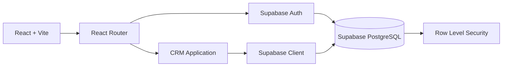

# Plano do CRM imobiliário

## 1. Objetivo do MVP

Construir um CRM web para um consultor imobiliário com:

- Cadastro e login de usuários.
- Recuperação de senha.
- Cadastro, edição, visualização e exclusão de clientes.
- Cadastro, edição, visualização e exclusão de várias notas por cliente.
- Listagem com busca e filtros, incluindo região.
- Persistência no Supabase.
- Isolamento dos dados por usuário autenticado.
- Interface responsiva para desktop e mobile.

A primeira versão deve ser simples, segura e preparada para futuras funções, como imóveis, oportunidades, tarefas e histórico de contatos.

## 2. Stack proposta

### Frontend

- Vite.
- React.
- TypeScript.
- React Router.
- Tailwind CSS.
- Supabase JS.
- React Hook Form.
- Zod.
- TanStack Query.
- Biblioteca de ícones, como Lucide React.
- Vitest e Testing Library.
- ESLint e Prettier.

As dependências devem ser instaladas usando as versões estáveis mais recentes no momento da implementação e fixadas no `package.json` e no lockfile.

### Backend e dados

Inicialmente, o Supabase será utilizado diretamente pela plataforma Supabase, por meio do dashboard e da API gerada para o projeto. Não será necessário manter um backend próprio para o MVP.

O Supabase será responsável por:

- PostgreSQL.
- Autenticação.
- Row Level Security.
- API REST gerada automaticamente.
- Realtime, caso seja necessário futuramente.
- Armazenamento de arquivos, se forem adicionadas fotos ou documentos.

O frontend acessará o Supabase diretamente usando o cliente oficial, com as políticas de RLS protegendo os dados no banco.

## 3. Arquitetura geral



A aplicação deve seguir uma arquitetura orientada por funcionalidades, evitando organizar tudo apenas por tipo de arquivo.

Estrutura sugerida:

```text
src/
  app/
    App.tsx
    router.tsx
    providers.tsx

  components/
    ui/
    layout/
    feedback/

  features/
    auth/
      pages/
      components/
      services/
      schemas.ts
      types.ts

    clients/
      pages/
      components/
      services/
      hooks/
      schemas.ts
      types.ts

    notes/
      components/
      services/
      hooks/
      schemas.ts
      types.ts

  lib/
    supabase.ts
    query-client.ts
    utils.ts

  styles/
    globals.css

  types/
    database.types.ts
```

## 4. Modelo de dados

### Tabela `profiles`

A tabela de perfis complementa o usuário criado pelo Supabase Auth.

Campos:

- `id uuid primary key`.
- `full_name text not null`.
- `email text not null`.
- `phone text`.
- `created_at timestamptz`.
- `updated_at timestamptz`.

O `id` deve referenciar `auth.users(id)`.

### Tabela `clients`

Campos:

- `id uuid primary key`.
- `owner_id uuid not null`.
- `name text not null`.
- `email text`.
- `phone text`.
- `status text`.
- `source text`.
- `region text`.
- `income number`.
- `income_type text`.
- `created_at timestamptz`.
- `updated_at timestamptz`.

Valores possíveis para `status`:

- `lead`.
- `contacted`.
- `qualified`.
- `client`.
- `inactive`.

Valores possíveis para `source`:

- `indication`.
- `instagram`.
- `website`.
- `whatsapp`.
- `portal`.
- `other`.

Para campos controlados, é preferível usar constraints ou enums no banco, em vez de aceitar qualquer texto.

### Tabela `notes`

Cada cliente poderá ter várias notas. A tabela deve ter os seguintes campos:

- `id uuid primary key`.
- `client_id uuid not null`.
- `title text not null`.
- `description text`.
- `created_at timestamptz`.
- `updated_at timestamptz`.

O campo `client_id` deve referenciar `clients(id)` com uma foreign key. A exclusão de um cliente deve preferencialmente usar `ON DELETE CASCADE`, para evitar registros órfãos.

### Índices

Criar índices para:

- `owner_id` em `clients`.
- `status` em `clients`.
- `source` em `clients`.
- `region` em `clients`.
- `created_at` em `clients`.
- `name` em `clients`.
- `email` em `clients`.
- `client_id` em `notes`.

A busca por nome, e-mail e telefone pode começar com filtros simples. Se o volume crescer, poderá ser adicionado um índice `GIN` com busca textual.

## 5. Segurança com RLS

A segurança não deve depender apenas do frontend.

Políticas esperadas na tabela `clients`:

- Usuário autenticado pode visualizar somente seus próprios clientes.
- Usuário autenticado pode inserir cliente somente com seu próprio `owner_id`.
- Usuário pode editar somente seus próprios clientes.
- Usuário pode excluir somente seus próprios clientes.

Políticas esperadas na tabela `notes`:

- Usuário autenticado pode visualizar somente notas de clientes que pertencem a ele.
- Usuário autenticado pode criar notas somente para clientes que pertencem a ele.
- Usuário pode editar somente notas de seus próprios clientes.
- Usuário pode excluir somente notas de seus próprios clientes.

Regra conceitual:

```sql
owner_id = auth.uid()
```

Para as notas, a autorização deve validar o proprietário do cliente relacionado, e não apenas a existência de uma sessão autenticada.

Também será necessário impedir que o frontend consiga inserir um `owner_id` diferente do usuário autenticado. Isso deve ser garantido pela política de `INSERT`, e não somente pelo formulário.

Para `profiles`:

- Usuário pode visualizar o próprio perfil.
- Usuário pode atualizar o próprio perfil.
- Usuário não pode alterar o `id`.

O campo `profiles.email` deve permanecer sincronizado com o e-mail usado no Supabase Auth. A definição de como tratar alterações futuras de e-mail deve ser estabelecida antes de implementar a edição de perfil.

As chaves públicas do Supabase podem ficar no frontend. A `service_role key` jamais deve ser exposta no Vite.

## 6. Fluxo de autenticação

### Login

Rota:

```text
/login
```

Campos:

- E-mail.
- Senha.

Comportamento:

1. Validar os campos no frontend.
2. Chamar autenticação por e-mail e senha.
3. Exibir erro amigável quando as credenciais forem inválidas.
4. Redirecionar para a listagem de clientes.
5. Preservar a sessão automaticamente.

### Cadastro

Rota:

```text
/signup
```

Campos:

- Nome completo.
- E-mail.
- Senha.
- Confirmação da senha.

Validações:

- E-mail válido.
- Senha com tamanho mínimo.
- Confirmação igual à senha.
- Nome obrigatório.

Após o cadastro:

- Criar usuário no Supabase Auth.
- Criar seu registro em `profiles`, incluindo o e-mail.
- Caso a confirmação de e-mail esteja habilitada, informar o usuário.
- Caso contrário, redirecionar para o CRM.

Uma alternativa mais robusta é criar automaticamente o perfil por meio de uma função ou trigger no banco após a criação do usuário.

### Recuperação de senha

Mesmo que não esteja no primeiro desenho visual, deve ser incluída no MVP:

```text
/forgot-password
/reset-password
```

Isso reduz dependência operacional do administrador e evita que o fluxo de autenticação fique incompleto.

### Proteção de rotas

Rotas públicas:

- `/login`.
- `/signup`.
- `/forgot-password`.
- `/reset-password`.

Rotas privadas:

- `/clients`.
- `/clients/new`.
- `/clients/:id/edit`.
- `/clients/:id/notes`.
- `/profile`.

Criar um componente de proteção de rota que:

- Verifica a sessão atual.
- Exibe estado de carregamento.
- Redireciona usuários não autenticados para `/login`.
- Evita redirecionamentos prematuros enquanto a sessão está sendo carregada.

## 7. Telas do sistema

### Login

Elementos:

- Logo ou identificação do CRM.
- Campo de e-mail.
- Campo de senha.
- Botão de entrar.
- Link para cadastro.
- Link para recuperação de senha.
- Mensagens de erro.

### Cadastro

Elementos:

- Nome.
- E-mail.
- Senha.
- Confirmação de senha.
- Botão de criar conta.
- Link para login.

### Listagem de clientes

Essa será a tela principal.

Elementos:

- Cabeçalho com nome do usuário.
- Botão “Novo cliente”.
- Campo de busca.
- Filtro por status.
- Filtro por origem.
- Filtro por região.
- Ordenação por nome ou data.
- Tabela no desktop.
- Lista ou cartões compactos no mobile.
- Ações de editar e excluir.
- Estado vazio.
- Estado de carregamento.
- Estado de erro.
- Paginação, se necessário.

Filtros recomendados:

- Busca por nome, e-mail ou telefone.
- Status.
- Origem.
- Região.
- Período de criação, em uma etapa posterior.

A URL deve refletir os filtros quando possível:

```text
/clients?search=joao&status=lead&region=sul
```

Isso facilita compartilhamento, navegação e manutenção do estado ao recarregar a página.

### Cadastro e edição de cliente

Pode ser o mesmo formulário reutilizado nas rotas:

```text
/clients/new
/clients/:id/edit
```

Campos:

- Nome.
- E-mail.
- Telefone.
- Status.
- Origem.
- Região.

O formulário deve ter:

- Validação com Zod.
- Mensagens por campo.
- Estado de envio.
- Prevenção de submissão duplicada.
- Feedback após sucesso.
- Tratamento de erros do Supabase.
- Confirmação ao sair com alterações não salvas, se viável.

### Notas do cliente

As notas devem ser gerenciadas em uma área própria do cliente, permitindo:

- Listar todas as notas do cliente.
- Criar nota com título e descrição.
- Editar uma nota existente.
- Excluir uma nota mediante confirmação.
- Exibir datas de criação e atualização.

### Exclusão

A exclusão deve exigir confirmação em modal.

A mensagem deve identificar o cliente e explicar que a ação não poderá ser desfeita. Ao excluir um cliente, suas notas também serão removidas pela regra de relacionamento definida no banco.

Após excluir:

- Remover o registro da listagem.
- Exibir feedback visual.
- Atualizar a paginação, se aplicável.

## 8. Gerenciamento de dados

Recomendo TanStack Query para:

- Buscar clientes.
- Buscar notas por cliente.
- Armazenar cache.
- Invalidar a listagem após cadastro, edição ou exclusão.
- Controlar carregamento e erros.
- Evitar chamadas duplicadas.

Hooks esperados para clientes:

```text
useClients
useClient
useCreateClient
useUpdateClient
useDeleteClient
```

Hooks esperados para notas:

```text
useNotes
useNote
useCreateNote
useUpdateNote
useDeleteNote
```

As chamadas ao Supabase devem ficar em serviços das features, e não diretamente dentro dos componentes visuais.

Exemplos conceituais:

```text
features/clients/services/client-service.ts
features/notes/services/note-service.ts
```

Isso facilita testes, manutenção e eventual troca de implementação.

## 9. Validação

A validação deve existir em dois níveis.

### Frontend

Usar Zod para:

- Mensagens imediatas.
- Validação de formato.
- Melhor integração com React Hook Form.

### Banco

Usar constraints para:

- Campos obrigatórios.
- Valores permitidos.
- Relacionamentos.
- Integridade dos dados.

O frontend melhora a experiência, mas o banco permanece como autoridade final.

## 10. Estados de interface

Cada tela deve tratar explicitamente:

- Carregando.
- Sucesso.
- Erro.
- Lista vazia.
- Busca sem resultados.
- Formulário inválido.
- Sessão expirada.
- Operação em andamento.
- Falha de rede.

Evitar deixar a tela vazia durante carregamentos. Usar skeletons ou indicadores consistentes.

## 11. Design e responsividade

Para um CRM, a interface deve priorizar velocidade de uso e leitura:

- Layout limpo e funcional.
- Navegação lateral ou cabeçalho compacto.
- Tabela para telas grandes.
- Cards/lista para telas pequenas.
- Botões com ícones reconhecíveis.
- Ações perigosas visualmente distintas.
- Contraste adequado.
- Foco visível para navegação por teclado.
- Labels reais nos campos, não apenas placeholders.
- Componentes reutilizáveis para inputs, selects, modais, tabelas e alertas.

O Tailwind deve ser configurado com tokens consistentes para cores, espaçamentos, tipografia e estados.

## 12. Variáveis de ambiente

Arquivo local:

```text
.env.local
```

Variáveis esperadas:

```text
VITE_SUPABASE_URL=
VITE_SUPABASE_ANON_KEY=
```

Também deve existir um `.env.example` sem valores secretos.

As variáveis `VITE_*` ficam disponíveis no bundle do frontend. Portanto, somente valores públicos do Supabase devem ser usados ali.

## 13. Testes

### Testes unitários

- Schemas de validação de autenticação, clientes e notas.
- Funções de transformação de dados.
- Regras de filtros, incluindo região.

### Testes de componentes

- Login com dados inválidos.
- Cadastro com senhas diferentes.
- Formulário de cliente.
- Filtro por região.
- Listagem de notas.
- Formulário de nota.
- Estado vazio.
- Modal de confirmação de exclusão.

### Testes de integração

- Usuário autenticado consegue criar cliente.
- Usuário consegue editar próprio cliente.
- Usuário consegue criar e editar notas de próprio cliente.
- Usuário não acessa cliente ou notas de outro usuário.
- Exclusão de cliente remove suas notas.
- Exclusão atualiza a listagem.

### Testes E2E

Fluxo principal:

1. Criar conta.
2. Fazer login.
3. Criar cliente com região.
4. Filtrar cliente por região.
5. Criar uma nota para o cliente.
6. Editar cliente e nota.
7. Excluir cliente.
8. Fazer logout.

## 14. Fases de implementação

### Fase 1: Fundação

- Criar projeto Vite com React e TypeScript.
- Configurar Tailwind.
- Configurar ESLint e Prettier.
- Configurar React Router.
- Configurar cliente Supabase.
- Criar layout base.
- Configurar variáveis de ambiente.

### Fase 2: Banco e autenticação no Supabase

- Criar o projeto na plataforma Supabase.
- Criar as tabelas `profiles`, `clients` e `notes` pelo dashboard ou SQL Editor.
- Criar foreign keys, constraints e índices.
- Ativar RLS em todas as tabelas expostas.
- Criar e testar as políticas de acesso.
- Configurar autenticação por e-mail.
- Implementar login.
- Implementar cadastro.
- Implementar logout.
- Implementar proteção de rotas.
- Implementar recuperação de senha.

### Fase 3: Clientes e notas

- Criar tipos do banco.
- Criar schemas de validação.
- Criar serviço de clientes.
- Criar serviço de notas.
- Implementar listagem.
- Implementar busca.
- Implementar filtros.
- Implementar filtro por região.
- Implementar cadastro.
- Implementar edição.
- Implementar exclusão.
- Implementar gerenciamento de notas por cliente.

### Fase 4: Qualidade e UX

- Estados de loading e erro.
- Responsividade.
- Acessibilidade.
- Toasts e confirmações.
- Tratamento de sessão expirada.
- Testes automatizados.
- Revisão das políticas RLS.

### Fase 5: Deploy na Vercel

Frontend:

- Publicar o frontend na Vercel.
- Configurar o repositório e o comando de build.
- Configurar as variáveis `VITE_SUPABASE_URL` e `VITE_SUPABASE_ANON_KEY` no projeto da Vercel.

Backend:

- Utilizar o projeto hospedado na plataforma Supabase.

Checklist:

- Configurar variáveis de produção na Vercel.
- Configurar URLs de redirecionamento do Supabase Auth para o domínio da Vercel.
- Configurar domínio autorizado.
- Executar build de produção.
- Verificar políticas RLS em ambiente real.
- Testar login, logout e recuperação de senha.
- Testar criação, edição e exclusão de clientes e notas.
- Configurar monitoramento de erros.

## 15. Evolução futura

A estrutura deve permitir adicionar:

- Cadastro de imóveis.
- Relacionamento entre clientes e imóveis.
- Funil de vendas.
- Histórico de interações.
- Tarefas e lembretes.
- Agenda.
- Upload de documentos.
- Importação por CSV.
- Perfis com diferentes permissões.
- Multiusuário para uma imobiliária.
- Dashboard com métricas.
- Notificações.

A decisão mais importante para preservar essa evolução é manter `owner_id`, RLS, serviços isolados, o relacionamento entre clientes e notas e o domínio organizado por funcionalidades desde o início.
